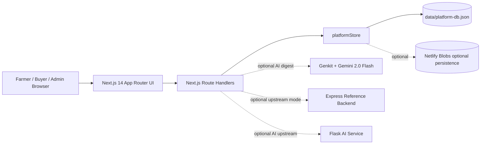
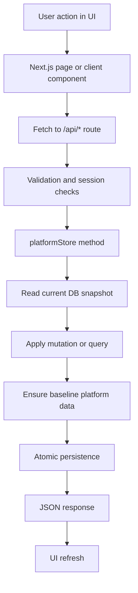
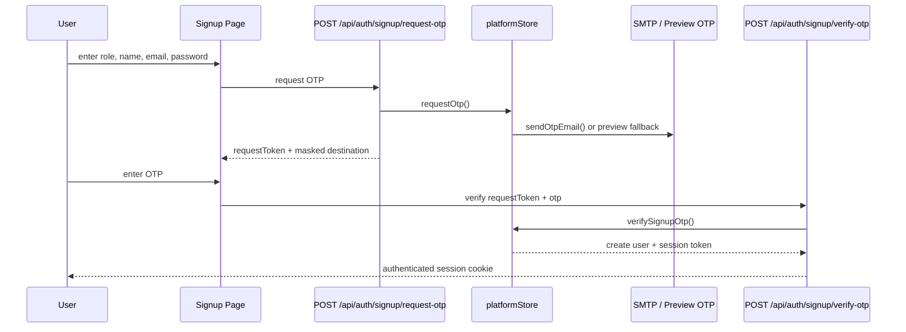

# Unified Farmers Marketplace

Unified Farmers Marketplace is a multi-role agriculture platform built around one idea: give farmers, buyers, and administrators a single workspace for verified trade, pricing intelligence, AI-assisted decision support, finance workflows, and trust-driven platform governance.

This repository currently contains two architectural layers:

1. The live web application: a Next.js 14 App Router application that serves the UI and the active API surface in `src/app/api/**`.
2. The extended reference backend stack: an Express + MongoDB API in `backend/` and a Flask-based AI microservice in `ai-service/`.

The live deployment is:

- `https://unified-farmers-marketplace.netlify.app`

## Why This Project Exists

Agricultural commerce usually breaks across disconnected tools:

- farmers need price discovery, buyer access, logistics visibility, and financing;
- buyers need verified lots, negotiation channels, and dispatch visibility;
- administrators need trust review, moderation, settlement oversight, and operational telemetry.

This project combines those concerns into one role-aware system with:

- session-based access control,
- marketplace and buyer directory flows,
- AgriTrust verification workflows,
- AI-assisted advisory and prediction surfaces,
- finance and wallet workflows,
- analytics and admin command views,
- persistent platform data for demos and production-like prototypes.

## Screenshot Gallery

The screenshots below were captured from the live Netlify deployment on `2026-04-22`.

The public deployment exposes only a small set of non-authenticated pages without using session cookies. Authenticated dashboard pages are intentionally not embedded here because they require a secure session and this README should not store reusable auth state.

### Live Login Screen

The login image is intentionally cropped to exclude hardcoded footer details from the page.


### Live Signup Screen


## Table of Contents

- [What the Platform Does](#what-the-platform-does)
- [Current Runtime Architecture](#current-runtime-architecture)
- [System Diagrams](#system-diagrams)
- [Tech Stack](#tech-stack)
- [Repository Layout](#repository-layout)
- [Role Model](#role-model)
- [Core Product Modules](#core-product-modules)
- [Data Model](#data-model)
- [How the Main Workflows Work](#how-the-main-workflows-work)
- [Algorithms and Heuristics](#algorithms-and-heuristics)
- [Live Next.js API Reference](#live-nextjs-api-reference)
- [Reference Express and Python Services](#reference-express-and-python-services)
- [Local Development Setup](#local-development-setup)
- [Environment Variables](#environment-variables)
- [Deployment Guide](#deployment-guide)
- [How to Reuse This in Another Project](#how-to-reuse-this-in-another-project)
- [Testing](#testing)
- [Security and Privacy Notes](#security-and-privacy-notes)
- [Known Limitations](#known-limitations)

## What the Platform Does

### Farmer-side capabilities

- view mandi-style commodity prices;
- receive AI-style pricing insight and seven-day price outlooks;
- publish produce lots with grade, quantity, moisture, and pricing band data;
- find verified buyers;
- submit buyer interaction requests and negotiation offers;
- request wallet funding and loans;
- submit field reports;
- manage a role-aware profile and trust verification data;
- use AI crop, soil, and disease tools.

### Buyer-side capabilities

- browse verified farmer lots;
- browse buyers and sourcing network data;
- open offers and negotiations;
- review trust-verified counterparties;
- track procurement, finance, and operational records;
- use the same session and notification system as farmers.

### Admin-side capabilities

- review trust queues and AgriTrust submissions;
- validate farmers and buyers;
- issue wallet grants;
- review field reports;
- monitor shipment timelines and dispatch queues;
- manage buyers, notifications, forms, and platform configuration;
- inspect analytics snapshots and operations digests.

## Current Runtime Architecture

### Active live application

The active web app is a Next.js App Router project:

- UI pages live in `src/app/**`
- active API endpoints live in `src/app/api/**`
- business logic lives primarily in `src/lib/server/**`
- persistent data is managed by `src/lib/server/store.ts`

The current live architecture is intentionally self-contained. It can run as a single deployable Next.js application and does not strictly require MongoDB or the Flask service.

### Reference service-oriented architecture

The repository also contains:

- `backend/`: Express + MongoDB + Razorpay + JWT-based API
- `ai-service/`: Flask microservice for disease and soil inference
- `docker-compose.yml`: orchestration for MongoDB, Mongo Express, backend, AI service, and Nginx

This makes the repo useful in two ways:

- as a deployed Netlify-style monolithic application,
- as a reference for how to split the same domain into independent services.

## System Diagrams

### 1. High-level system view



### 2. Current request/data flow



### 3. Signup with OTP



## Tech Stack

- Next.js `14.2.5`
- React `18.3.1`
- TypeScript
- Tailwind CSS
- Radix UI primitives
- Recharts
- Zustand
- React Hook Form
- Genkit
- `@genkit-ai/googleai`
- optional Netlify Blobs persistence
- Express, MongoDB, Flask, and Docker in the reference stack

## Repository Layout

```text
.
|-- src/
|   |-- app/                      # Next.js App Router pages and APIs
|   |-- components/               # UI and feature components
|   |-- context/                  # auth, language, pro-status
|   |-- hooks/                    # client hooks such as cart and toast
|   |-- lib/
|   |   |-- server/               # active backend logic
|   |   |-- client/               # browser utilities
|   |   |-- types.ts              # central domain types
|   |-- ai/                       # Genkit flows
|-- data/platform-db.json         # live demo/store data
|-- docs/                         # supporting docs and screenshots
|-- backend/                      # Express reference backend
|-- ai-service/                   # Flask AI microservice
|-- scripts/netlify-deploy.mjs    # manual Netlify deploy helper
|-- docker-compose.yml            # reference multi-service stack
|-- netlify.toml                  # Netlify build settings
```

## Role Model

The application has three core roles:

| Role | Internal value | Main purpose |
|---|---|---|
| Farmer | `user` | sells produce, receives insights, submits reports |
| Buyer | `buyer` | sources produce, negotiates, verifies farmers in limited trust flows |
| Admin | `admin` | governs trust, finance, notifications, buyers, and operations |

Role awareness affects:

- redirects after login/signup;
- accessible pages;
- profile schema;
- API authorization;
- admin-only controls;
- visibility of notifications, reports, shipments, and trust queues.

## Core Product Modules

### 1. Authentication and session management

- direct password login for all roles
- OTP-based signup only
- signed HTTP-only session cookie: `fm_session`
- seven-day session TTL
- HMAC-SHA256 payload signing using `APP_SECRET`

### 2. Marketplace

- input products catalog
- farmer lots/listings
- price, stock, MOQ, lead time, location, tags
- cart support
- listing creation from UI

### 3. Buyer network

- buyer directory
- demand profiles
- message/call interaction requests
- negotiation records

### 4. Pricing and analytics

- commodity prices by market
- heuristic MSP-based price suggestion
- AI-style digests for dashboard, analytics, and admin views

### 5. AgriTrust workflow

- role-aware profile data
- farmer Aadhaar workflow
- buyer GSTIN workflow
- form creation and submission
- admin and buyer verification

### 6. Finance

- ledger entries
- wallet funding requests
- loan applications
- admin grants
- settlement configuration

### 7. Operations

- shipments and checkpoints
- notifications
- communication groups and group messages
- field intelligence reports

### 8. AI tools

- price trend outlook
- disease diagnosis
- soil quality assessment
- crop detection
- advisory summaries

## Data Model

The active live app uses a unified `PlatformDb` type in `src/lib/types.ts`.

Core collections inside the JSON store:

- `users`
- `profiles`
- `otpChallenges`
- `products`
- `listings`
- `buyers`
- `prices`
- `posts`
- `orders`
- `payments`
- `predictions`
- `buyerInteractions`
- `priceAlerts`
- `notifications`
- `shipments`
- `invoices`
- `financeTransactions`
- `walletFundingRequests`
- `loanApplications`
- `negotiations`
- `agriTrustForms`
- `agriTrustSubmissions`
- `fieldReports`
- `communicationGroups`
- `communicationGroupMessages`
- `config`

### Persistence behavior

The store layer is more robust than a plain `fs.writeFile()` demo:

- reads and writes are centralized in `src/lib/server/store.ts`
- a mutation queue serializes writes
- data is cached in memory between reads
- writes are flushed atomically
- optional Netlify Blobs support exists for hosted persistence
- baseline platform records are merged in through `ensurePlatformBaseline()`

### Health endpoint output

`GET /api/health` reports record counts for major collections, including:

- users
- products
- listings
- buyers
- prices
- predictions
- wallet requests
- negotiations
- forms
- field reports

## How the Main Workflows Work

### 1. Login flow

Files involved:

- `src/app/login/page.tsx`
- `src/context/auth-context.tsx`
- `src/app/api/auth/login/route.ts`
- `src/lib/server/auth.ts`
- `src/lib/server/store.ts`

Flow:

1. user selects role, email, password;
2. client posts to `/api/auth/login`;
3. route validates payload and calls `platformStore.login(...)`;
4. on success, `setLocalSessionCookie(user)` writes `fm_session`;
5. user is redirected according to role:
   - admin -> `/admin/dashboard`
   - buyer -> `/buyers`
   - farmer -> `/`

### 2. Signup flow with OTP

Files involved:

- `src/app/signup/page.tsx`
- `src/app/api/auth/signup/request-otp/route.ts`
- `src/app/api/auth/signup/verify-otp/route.ts`
- `src/lib/server/otp-delivery.ts`
- `src/lib/server/store.ts`

Flow:

1. user enters role, name, email, password;
2. server creates OTP challenge and hashed pending password;
3. OTP is emailed through SMTP when configured;
4. in non-production without SMTP, a preview OTP can be returned for development;
5. user submits OTP;
6. server verifies challenge, creates user, provisions workspace profile, and signs session cookie.

### 3. Marketplace listing flow

Files involved:

- `src/app/(app)/marketplace/marketplace-client.tsx`
- `src/app/api/marketplace/listings/route.ts`
- `src/lib/server/store.ts`

Flow:

1. user opens marketplace;
2. products and listings are loaded from `platformStore`;
3. farmer can publish a lot from the dialog;
4. listing is stored with commodity, location, quantity, grade, moisture, and pricing mode;
5. listing becomes visible to trade surfaces and analytics snapshots.

### 4. Buyer interaction and negotiation flow

Files involved:

- `src/app/(app)/buyers/buyers-client.tsx`
- `src/app/api/buyer-interactions/route.ts`
- `src/app/api/negotiations/route.ts`

Flow:

1. user selects buyer;
2. user submits message/call request or negotiation offer;
3. interaction or negotiation record is stored;
4. dashboards can reflect the new operational state.

### 5. Order, payment, and shipment flow

Files involved:

- `src/app/api/orders/route.ts`
- `src/app/api/payments/checkout/route.ts`
- `src/app/api/shipments/route.ts`
- `src/app/api/shipments/acknowledge/route.ts`

Flow:

1. authenticated user posts order items and shipping address;
2. order total is derived from item list;
3. checkout route records payment against order;
4. shipment status can be updated by admin;
5. the receiving user can acknowledge delivery.

### 6. Field report reward flow

Files involved:

- `src/app/api/field-reports/route.ts`
- `src/app/api/admin/trust/route.ts`
- `src/lib/server/store.ts`

Flow:

1. farmer submits mandi-price, weather, or crop-status report;
2. report enters admin review queue;
3. admin verifies or rejects report;
4. verified report can trigger wallet credit, reward points, and notification events;
5. dashboard and analytics surfaces include that field intelligence.

### 7. AgriTrust verification flow

Files involved:

- `src/app/api/profile/route.ts`
- `src/app/api/agri-trust/forms/route.ts`
- `src/app/api/agri-trust/profiles/route.ts`
- `src/app/api/agri-trust/submissions/route.ts`
- `src/app/api/admin/trust/route.ts`

Flow:

1. farmer/buyer updates profile with Aadhaar or GSTIN-related data;
2. verification state becomes `pending`;
3. admin or eligible buyer reviews profile or form submission;
4. trust score and trust label are recalculated;
5. notifications are issued and downstream UI uses the verified state.

## Algorithms and Heuristics

This project mixes UI-first application logic with transparent deterministic heuristics.

### 1. Commodity MSP-based price suggestion

File:

- `src/lib/server/pricing.ts`

Main formula:

```text
Psuggested = Pbase × (1 + alpha × Dlocal - beta × Slocal)
```

Where:

- `Pbase` = commodity MSP baseline
- `Dlocal` = local demand index
- `Slocal` = local supply saturation index
- `alpha` = demand weighting
- `beta` = supply weighting

Outputs added back to price rows:

- `baseMsp`
- `localDemandIndex`
- `localSupplySaturationIndex`
- `alpha`
- `beta`
- `heuristicSuggestedPrice`

### 2. Seven-day price forecast

Files:

- `src/lib/server/ai.ts`
- `src/ai/flows/predict-price-trends.ts`

How it works:

- loads price history from the active store;
- finds commodity and optional location matches;
- builds a short forecast using:
  - current/base price,
  - average change percentage,
  - a bounded bias term,
  - a small sinusoidal cycle,
  - volatility derived from a deterministic text hash;
- generates seven dates with predicted prices;
- labels confidence as `High`, `Medium`, or `Low`;
- returns recommendation such as hold, sell now, or stagger sales.

### 3. Crop detection fallback

File:

- `src/lib/server/ai.ts`

The fallback crop detection uses:

- image texture signal from a hashed data URI slice,
- optional location signal,
- ranked confidence against a fixed crop list.

This is a deterministic UI-support heuristic, not a production computer-vision model.

### 4. Soil quality assessment

Files:

- `src/lib/server/ai.ts`
- `src/ai/flows/predict-soil-quality.ts`
- `ai-service/models/inference.py`

Modes:

- if `AI_SERVICE_URL` is available, the Next app calls the Flask service;
- otherwise it uses local heuristic scoring.

Local score inputs:

- pH
- moisture
- organic carbon

Local weighted scoring:

- pH score weighted at `0.34`
- moisture score weighted at `0.33`
- organic carbon score weighted at `0.33`

Output:

- score `0-100`
- grade: `Excellent`, `Good`, `Moderate`, `Poor`
- explanation
- recommendations

### 5. Disease diagnosis

Files:

- `src/lib/server/ai.ts`
- `src/ai/flows/identify-pest-disease.ts`
- `ai-service/models/inference.py`

Modes:

- remote Flask service if configured;
- deterministic fallback otherwise.

The Flask reference service currently classifies among:

- `healthy`
- `leaf_blight`
- `powdery_mildew`
- `rust`

### 6. AI digest generation

File:

- `src/lib/server/platform-insights.ts`

If `GOOGLE_API_KEY` is present:

- Genkit calls Gemini 2.0 Flash;
- the response is normalized into `headline`, `bullets`, and `recommendation`.

If `GOOGLE_API_KEY` is absent or the model fails:

- a local fallback digest is generated from trust, shipment, field report, and price signals.

## Live Next.js API Reference

### Health and auth

| Method | Route | Purpose |
|---|---|---|
| `GET` | `/api/health` | health counts and status |
| `POST` | `/api/auth/login` | direct password login |
| `POST` | `/api/auth/logout` | clear session |
| `GET` | `/api/auth/me` | current user from session |
| `POST` | `/api/auth/signup` | legacy signup route |
| `POST` | `/api/auth/signup/request-otp` | create signup OTP |
| `POST` | `/api/auth/signup/verify-otp` | verify OTP and create session |
| `POST` | `/api/auth/login/request-otp` | retired; returns `410` |
| `POST` | `/api/auth/login/verify-otp` | retired; returns `410` |

### User and profile

| Method | Route | Purpose |
|---|---|---|
| `GET` | `/api/users` | list users; admin gets all |
| `PATCH` | `/api/users` | update user record |
| `GET` | `/api/profile` | profile + orders + invoices + shipments + notifications |
| `PATCH` | `/api/profile` | update role-aware workspace profile |

### Marketplace and prices

| Method | Route | Purpose |
|---|---|---|
| `GET` | `/api/marketplace/products` | list input products |
| `POST` | `/api/marketplace/products` | create product |
| `GET` | `/api/marketplace/listings` | list farmer lots |
| `POST` | `/api/marketplace/listings` | create lot |
| `GET` | `/api/prices` | list commodity price rows |
| `POST` | `/api/prices` | create/update price-related entry |
| `GET` | `/api/price-alerts` | list user price alerts |
| `POST` | `/api/price-alerts` | create price alert |

### Buyers, trade network, and communication

| Method | Route | Purpose |
|---|---|---|
| `GET` | `/api/buyers` | list buyers |
| `POST` | `/api/buyers` | admin creates buyer |
| `PATCH` | `/api/buyers` | admin updates buyer |
| `DELETE` | `/api/buyers` | admin deletes buyer |
| `GET` | `/api/buyer-interactions` | list buyer interactions |
| `POST` | `/api/buyer-interactions` | create call/message interaction |
| `GET` | `/api/negotiations` | list negotiations |
| `POST` | `/api/negotiations` | create negotiation |
| `PATCH` | `/api/negotiations` | update negotiation state |
| `GET` | `/api/communication-groups` | list communication groups |
| `POST` | `/api/communication-groups` | create communication group |
| `GET` | `/api/communication-groups/messages` | list messages in group |
| `POST` | `/api/communication-groups/messages` | create group message |

### Orders, shipments, and notifications

| Method | Route | Purpose |
|---|---|---|
| `GET` | `/api/orders` | list orders |
| `POST` | `/api/orders` | create order |
| `POST` | `/api/payments/checkout` | record payment for order |
| `GET` | `/api/shipments` | list shipments |
| `PATCH` | `/api/shipments` | admin updates shipment |
| `POST` | `/api/shipments/acknowledge` | acknowledge delivery |
| `GET` | `/api/notifications` | list notifications |
| `POST` | `/api/notifications` | admin broadcast/create notifications |
| `PATCH` | `/api/notifications` | mark notification as read |

### Finance

| Method | Route | Purpose |
|---|---|---|
| `GET` | `/api/finance/transactions` | list finance ledger entries |
| `POST` | `/api/finance/transactions` | create transaction |
| `GET` | `/api/finance/loans` | list loans |
| `POST` | `/api/finance/loans` | submit loan request |
| `PATCH` | `/api/finance/loans` | admin review loan |
| `GET` | `/api/finance/wallet-requests` | list wallet funding requests |
| `POST` | `/api/finance/wallet-requests` | create wallet funding request |
| `PATCH` | `/api/finance/wallet-requests` | update funding request |

### Community, trust, search, analytics, and utilities

| Method | Route | Purpose |
|---|---|---|
| `GET` | `/api/community/posts` | list community posts |
| `POST` | `/api/community/posts` | create post |
| `PATCH` | `/api/community/posts` | update post |
| `DELETE` | `/api/community/posts` | delete post |
| `GET` | `/api/field-reports` | list field reports |
| `POST` | `/api/field-reports` | farmer submits report |
| `GET` | `/api/agri-trust/forms` | list trust forms |
| `POST` | `/api/agri-trust/forms` | admin creates trust form |
| `GET` | `/api/agri-trust/profiles` | list trust profiles |
| `PATCH` | `/api/agri-trust/profiles` | verify profile |
| `GET` | `/api/agri-trust/submissions` | list trust submissions |
| `POST` | `/api/agri-trust/submissions` | submit trust form |
| `GET` | `/api/admin/trust` | admin control-room payload |
| `PATCH` | `/api/admin/trust` | verify/review/grant wallet |
| `GET` | `/api/admin/config` | get platform config |
| `PATCH` | `/api/admin/config` | update platform config |
| `POST` | `/api/admin/invitations` | admin invite flow |
| `GET` | `/api/dashboard/overview` | dashboard snapshot + insight digest |
| `GET` | `/api/analytics/overview` | analytics snapshot + digest |
| `GET` | `/api/global-search` | cross-entity search |
| `GET` | `/api/weather` | weather utility route |

## Reference Express and Python Services

The repo also carries a broader backend design.

### Express backend (`backend/`)

Important characteristics:

- JWT access and refresh tokens
- MongoDB models for users, products, orders, reviews, price alerts, transactions, KYC, and audit logs
- middleware for role auth, validation, error handling, and security
- rate limiting, Helmet, NoSQL sanitization, XSS cleaning, HPP
- Razorpay payment integration

Important docs:

- `backend/docs/API.md`
- `backend/docs/DATABASE_MODEL.md`

### Flask AI service (`ai-service/`)

Endpoints:

- `GET /health`
- prediction routes from `routes/predict.py`

Current inference behavior:

- lightweight deterministic mock-friendly inference
- disease class selection based on image signal
- soil score from simplified weighted scoring

## Local Development Setup

### Option A: Run the active Next.js app

Requirements:

- Node.js 20+
- npm

Steps:

```bash
npm install
cp .env.example .env.local
npm run dev
```

Key routes:

- app UI: `http://localhost:3000`
- health: `http://localhost:3000/api/health`

### Option B: Run the reference multi-service stack

Requirements:

- Docker
- Docker Compose

Steps:

```bash
docker compose up --build
```

Services exposed:

- MongoDB: `27017`
- Mongo Express: `8081`
- Flask AI service: `5000`
- Express backend: `8080`
- Nginx: `80` and `443`

### Option C: Run reference backend services manually

Express backend:

```bash
cd backend
npm install
npm run dev
```

Flask AI service:

```bash
cd ai-service
pip install -r requirements.txt
python app.py
```

## Environment Variables

The root `.env.example` documents the active app configuration:

```env
NODE_ENV=development
APP_SECRET=change-this-in-production
BACKEND_API_URL=http://localhost:8080
AI_SERVICE_URL=http://localhost:5000
GOOGLE_API_KEY=your_google_api_key
OTP_FROM_NAME=Farmer's Marketplace
OTP_FROM_EMAIL=no-reply@yourdomain.com
SMTP_HOST=smtp.gmail.com
SMTP_PORT=465
SMTP_SECURE=true
SMTP_USER=your_smtp_username
SMTP_PASS=your_smtp_password_or_app_password
```

### What each variable does

| Variable | Purpose |
|---|---|
| `APP_SECRET` | signs local session cookies and OTP hashes |
| `BACKEND_API_URL` | optional upstream Express backend |
| `AI_SERVICE_URL` | optional upstream Flask inference service |
| `GOOGLE_API_KEY` | enables Gemini-backed Genkit digests |
| `SMTP_*` | enables real OTP email delivery |
| `OTP_FROM_*` | mail sender identity |
| `NETLIFY_DB_STORE_NAME` | optional hosted blob store name |

## Deployment Guide

### Current live deployment style

The live app is configured for Netlify.

Relevant files:

- `netlify.toml`
- `scripts/netlify-deploy.mjs`
- `package.json`

`netlify.toml` uses:

- build command: `npm run build`
- Node version: `20`

### Manual Netlify deployment flow used in this repo

Scripts:

- `npm run deploy:preview`
- `npm run deploy:prod`

The deploy helper:

1. runs `netlify build`;
2. checks whether `.netlify/static` and `.netlify/functions` already exist;
3. works around Windows-local publish issues by uploading existing artifacts if needed;
4. calls `netlify deploy --no-build ...`;
5. optionally adds `--prod`.

### Production checklist

- set a strong `APP_SECRET`
- configure SMTP credentials for real OTP delivery
- add `GOOGLE_API_KEY` if AI digest generation should use Gemini
- configure persistent storage if multiple deploy instances are expected
- rotate or remove any demo records before public production use
- remove hardcoded presentation text that should not be public

## How to Reuse This in Another Project

If you want to implement the same idea in your own project, follow this order.

### Step 1: copy the domain model first

Start with the main entities from `src/lib/types.ts`:

- users
- role-aware profiles
- listings
- buyers
- prices
- orders
- payments
- notifications
- trust forms/submissions
- field reports
- loans
- wallet requests

### Step 2: copy the service layer, not just the UI

The most reusable file in the active app is:

- `src/lib/server/store.ts`

It already demonstrates:

- centralized data access
- session token creation and verification
- OTP workflow
- trust score logic
- notification fan-out
- shipment checkpoints
- field report reward actions

### Step 3: keep APIs thin

The route handlers in `src/app/api/**/route.ts` follow a useful pattern:

- validate request
- check session/role
- call store or service function
- return consistent JSON

### Step 4: keep heuristics out of components

This repo keeps domain logic in:

- `src/lib/server/pricing.ts`
- `src/lib/server/ai.ts`
- `src/lib/server/platform-data.ts`
- `src/lib/server/platform-insights.ts`

### Step 5: make trust a first-class workflow

This repo models:

- pending verification
- verified status
- who verified it
- trust score
- trust label
- role-specific proof requirements

### Step 6: start simple, then scale

For a prototype:

- the JSON store approach is enough
- it makes demo seeding and local testing easy

For production:

- move the same interfaces to PostgreSQL, MongoDB, or Firestore
- keep the route and service contracts stable

### Step 7: add AI as an enhancement, not a dependency

Most AI features here have non-AI fallback logic, which means:

- the app still works without model access,
- UX does not collapse during outages,
- testing remains easier.

## Testing

### Active Next.js app

There is no dedicated frontend test suite checked into the root project at the moment.

Validation today relies on:

- runtime page testing,
- route handler behavior,
- seeded baseline data,
- manual verification.

### Reference Express backend

The backend has Jest-based tests:

- `backend/tests/auth.test.js`
- `backend/tests/order.test.js`
- `backend/tests/payment.test.js`

Run with:

```bash
cd backend
npm test
```

## Security and Privacy Notes

This README intentionally omits sensitive personal information and secrets.

Not included here:

- real SMTP credentials
- private API keys
- `.env.local` contents
- reusable auth cookies
- non-essential personal contact data

Security measures visible in the codebase include:

- signed HTTP-only cookies
- password hashing with `scrypt`
- OTP hashing with HMAC
- role-based access checks
- Express hardening middleware in the reference backend
- authentication required for internal workspaces

## Known Limitations

These are important if you want to productionize this system.

### Active app limitations

- the live app uses a file-backed store by default, which is not ideal for horizontal scaling;
- some AI features are heuristic fallbacks, not production ML pipelines;
- public pages include presentation-specific text that should be reviewed before broad public release;
- the current Next config ignores TypeScript and ESLint errors during build:
  - `typescript.ignoreBuildErrors = true`
  - `eslint.ignoreDuringBuilds = true`

### Reference stack limitations

- the Flask AI service is currently a placeholder inference layer, not a trained production model;
- the Express backend and Next live API overlap conceptually and should be unified or clearly split in a long-term architecture;
- payment code in the reference backend still requires real secret management and production gateway configuration.

## Practical Summary

If you need to understand this project quickly:

1. The deployed app is a Next.js agriculture marketplace and operations platform.
2. The live backend is implemented through Next route handlers plus a JSON/optional blob-backed store.
3. The repo also includes a more traditional Express + MongoDB + Flask reference architecture.
4. Core value comes from role-aware workflows for farmers, buyers, and admins.
5. The strongest reusable parts are the data model, trust workflow, store abstraction, and transparent pricing heuristics.

## File References for Fast Navigation

- main app package: [package.json](/c:/Users/mishr/Unified%20Farmers%20Marketplace/package.json)
- active store/service layer: [src/lib/server/store.ts](/c:/Users/mishr/Unified%20Farmers%20Marketplace/src/lib/server/store.ts)
- domain types: [src/lib/types.ts](/c:/Users/mishr/Unified%20Farmers%20Marketplace/src/lib/types.ts)
- pricing algorithm: [src/lib/server/pricing.ts](/c:/Users/mishr/Unified%20Farmers%20Marketplace/src/lib/server/pricing.ts)
- AI logic: [src/lib/server/ai.ts](/c:/Users/mishr/Unified%20Farmers%20Marketplace/src/lib/server/ai.ts)
- platform baseline generators: [src/lib/server/platform-data.ts](/c:/Users/mishr/Unified%20Farmers%20Marketplace/src/lib/server/platform-data.ts)
- deployment helper: [scripts/netlify-deploy.mjs](/c:/Users/mishr/Unified%20Farmers%20Marketplace/scripts/netlify-deploy.mjs)
- Netlify config: [netlify.toml](/c:/Users/mishr/Unified%20Farmers%20Marketplace/netlify.toml)
- Docker orchestration: [docker-compose.yml](/c:/Users/mishr/Unified%20Farmers%20Marketplace/docker-compose.yml)
- reference backend API docs: [backend/docs/API.md](/c:/Users/mishr/Unified%20Farmers%20Marketplace/backend/docs/API.md)
- reference backend DB docs: [backend/docs/DATABASE_MODEL.md](/c:/Users/mishr/Unified%20Farmers%20Marketplace/backend/docs/DATABASE_MODEL.md)

## License and Ownership

If you want to use this project or to enhance anything whatsoever it contains. We as developers permit if used legally and inside an ethical environment without any kind of misuse for any reason whatsoever, the responsibility will be all yours. We invite the interested stakeholders to contribute it in an open environment.
